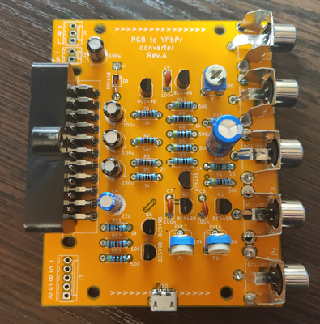

## RGB to YPbPr simple converter

Based on "Universal RGB-to-YPbPr/Component Encoder" by Steven Hanley (thesteve)

This schematic doesn't show perfect output picture quality, but uses cheap widely available parts.

Links:

https://www.pcenginefx.com/forums/index.php?topic=13231.0

https://www.sega-16.com/forum/showthread.php?28932-Universal-RGB-to-Component-Design
